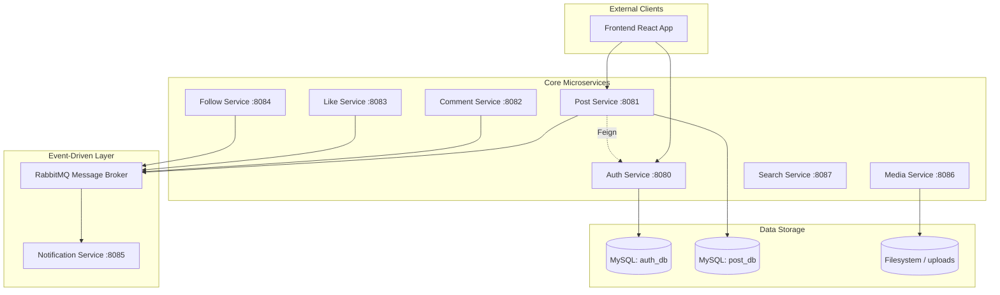

# 🌌 ConnectSphere - Backend

ConnectSphere is a high-performance, distributed microservices-based social media platform. The backend is built using **Java 17** and **Spring Boot 4.0.5**, utilizing a robust event-driven architecture to ensure scalability, reliability, and seamless user experiences.

---

## 🏗️ Architecture Overview

ConnectSphere follows a **Microservices Architecture** pattern, where each domain is isolated into its own service. This allows for independent scaling, deployment, and maintenance of different platform features.

### 🔌 System Design
The system employs both **Synchronous** (REST via OpenFeign) and **Asynchronous** (Event-driven via RabbitMQ) communication patterns.



---

## 🛠️ Microservices Breakdown

| Service | Port | Primary Responsibility | Key Technologies |
| :--- | :--- | :--- | :--- |
| **Auth Service** | `8080` | Identity management, JWT issuing, OAuth2 (Google), and service-to-service security. | Spring Security, JJWT, OAuth2 |
| **Post Service** | `8081` | Core post lifecycle (CRUD), feed management, and media association. | JPA, OpenFeign, RabbitMQ |
| **Comment Service** | `8082` | Threaded discussion management and engagement tracking. | JPA, RabbitMQ |
| **Like Service** | `8083` | Real-time engagement (liking/unliking) across posts and comments. | JPA, RabbitMQ |
| **Follow Service** | `8084` | Social graph management (Follow/Unfollow) and relationship status. | JPA, RabbitMQ |
| **Notification Service**| `8085` | Asynchronous alert system consuming events from RabbitMQ. | Spring AMQP, Java Mail |
| **Media Service** | `8086` | Binary data processing, storage, and retrieval for images/videos. | Spring Web, Filesystem API |
| **Search Service** | `8087` | Discovery service for users, posts, and trending hashtags. | JPA, Native Queries |

---

## 🚀 Technology Stack

- **Framework**: Spring Boot 4.0.5 (Project Parent)
- **Language**: Java 17
- **Messaging**: RabbitMQ (Asynchronous Event Processing)
- **Communication**: Spring Cloud OpenFeign (Synchronous REST)
- **Security**: JWT (JSON Web Tokens) & Spring Security
- **Database**: MySQL 8.x (Per-service schema isolation)
- **Documentation**: SpringDoc OpenAPI / Swagger UI
- **Build Tool**: Maven

---

## 🔐 Security Model

ConnectSphere implements a **Centralized JWT Authentication** mechanism:
1. **User Login**: `auth-service` validates credentials and issues an Access Token and a Refresh Token.
2. **Token Validation**: Every service contains a JWT Filter that validates the token using a shared secret.
3. **Internal Calls**: Service-to-service communication is secured via an `internal-service-secret` passed in the headers.

---

## 📡 Event-Driven Flow (RabbitMQ)

To ensure high availability and low latency, critical interactions trigger background events:
- **Like/Comment/Follow**: These services produce events to RabbitMQ exchanges.
- **Notification Service**: Consumes these events asynchronously to update user notifications without blocking the primary request thread.

---

## 📖 API Documentation

Each service exposes its own interactive API documentation. Once the services are running, you can access them at:
- **Auth Service**: `http://localhost:8080/swagger-ui.html`
- **Post Service**: `http://localhost:8081/swagger-ui.html`
- *...and so on for other services.*

---

## 🌐 Frontend Repository

The frontend for ConnectSphere is built with React, Vite, and TailwindCSS. You can find the frontend codebase here:

👉 **[ConnectSphere Frontend Repository](https://github.com/ayushgupta703/ConnectSphere-Frontend)**

---

## 🚀 Getting Started

1. **Prerequisites**: Install Java 17, Maven, MySQL, and RabbitMQ.
2. **Database Setup**: Create the necessary databases (`connectsphere_auth`, `connectsphere_post`, etc.).
3. **Configuration**: Update `application.properties` in each service with your credentials.
4. **Build & Run**:
   ```bash
   mvn clean install
   # Run individual services
   java -jar target/*.jar
   ```

